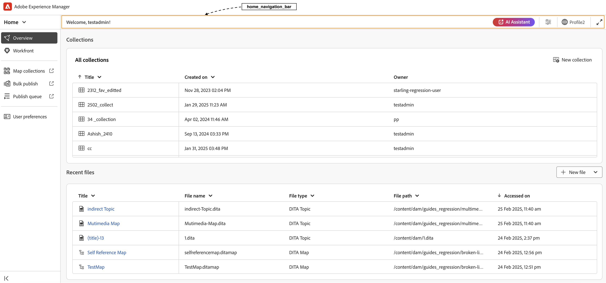
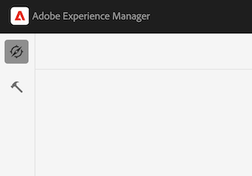

# Overzicht

Wanneer het migreren van oude UI naar nieuwe AEM Guides UI, moeten de updates aan **ui_config** in flexibelere en modulaire configuraties UI worden omgezet. Dit kaderhulp keurt naadloos veranderingen in **editor_toolbar** en [&#x200B; andere toolbars &#x200B;](/help/courses/course-3/conver-ui-config.md#editing-json-for-different-screens) goed. Het proces ondersteunt ook het wijzigen van andere weergaven en widgets in de toepassing.

>[!NOTE]
>
>Aanpassingen die worden toegepast op specifieke knoppen kunnen problemen veroorzaken tijdens de overgang naar het extensieframework. Als dit voorkomt, kunt u een steunkaartje met verwijzing naar deze pagina voor snelle steun en resolutie opheffen.

## JSON bewerken voor verschillende schermen

JSON-bestanden kunnen voor verschillende schermen en widgets worden toegevoegd aan de sectie UI Configuration van de XML Editor. Hieronder volgt een lijst met veel gebruikte widgets en hun id&#39;s:

1. [&#x200B; editor_toolbar &#x200B;](assets/toolbars/editor_toolbar.json): Webeditor toolbar die uit dossier en inhoudshandelingen bestaat.
1. [&#x200B; editor_tab_bar &#x200B;](assets/toolbars/editor_tab_bar.json): Van labels voorzien mening van open dossiers binnen webeditor, heeft acties u op geopende dossiers kunt uitvoeren.
1. [&#x200B; file_mode_switch &#x200B;](assets/toolbars/file_mode_switcher.json): Het helpt schakelen tussen verschillende beschikbare wijzen (auteur, bron, voorproef) voor de geopende dossiers binnen webeditor.

   

1. [&#x200B; map_console_navigation_bar &#x200B;](assets/toolbars/map_console_navigation_bar.json): Het is de informatiebar voor kaart die in kaartconsole wordt geopend. Hiermee kunt u de kaart wijzigen en hebt u toegang tot instellingen.
1. [&#x200B; map_console_action_bar &#x200B;](assets/toolbars/map_console_action_bar.json): Dit is de actiebar voor de punten van de kaartconsole zoals Vooraf ingestelde Output, Basislijn, Vertaling, en Rapporten die relevante informatie samen met hun respectieve actieknopen verstrekt.

   

1. [&#x200B; home_navigation_bar &#x200B;](assets/toolbars/home_navigation_bar.json): De bar van de Kopbal van Gidsen homepage waar het welkome bericht samen met geselecteerd omslagprofiel wordt getoond.

   

<br>

## Algemene structuur van elke JSON

Elke JSON volgt een consistente structuur:

1. `id` - Geeft de widget op waar de component wordt aangepast.
1. `targetEditor`: definieert wanneer een knop moet worden weergegeven of verborgen met de eigenschappen van de editor en modus:

   De volgende opties worden ondersteund onder `targetEditor` :

   - `mode`
   - `displayMode`
   - `editor`
   - `documentType`
   - `documentSubType`
   - `flag`

   Voor details, mening [&#x200B; Begrijpend eigenschappen targetEditor &#x200B;](#understanding-targeteditor-properties)

   >[!NOTE]
   >
   > De release 2506 van Experience Manager Guides introduceert nieuwe eigenschappen: `displayMode` , `documentType` , `documentSubType` en `flag` . Deze eigenschappen worden alleen vanaf versie 2506 ondersteund. Op dezelfde manier wordt de wijziging van `toc` in `layout` in de eigenschap mode ook toegepast vanaf deze release.
   >
   > Er is nu een nieuw veld, `documentType` , beschikbaar naast het bestaande veld `editor` .  Beide velden worden ondersteund en kunnen indien nodig worden gebruikt. Het gebruik van `documentType` wordt echter aanbevolen om consistentie tussen implementaties te garanderen, vooral wanneer u werkt met de eigenschap `documentSubType` . Het veld `editor` blijft geldig voor ondersteuning van compatibiliteit met oudere versies en bestaande integratie.


1. `target` - Geeft aan waar de nieuwe component wordt toegevoegd. Dit gebruikt sleutel-waardeparen of indexen voor unieke identificatie. Voorbeelden van weergavestatussen zijn:

   - **voeg** toe: voeg aan het eind toe.

   - **prepend**: Voeg aan het begin toe.

   - **vervangt**: Vervang een bestaande component.

Voorbeeld JSON-structuur:

```json
{
  "id" : "editor_toolbar",
  "view": {
    "items": [
      {
        ...,
        "targetEditor": {
          "mode": [
            "preview"
          ],
          "editor": [
            "xml"
          ]
        },
        "target": {
          "key": "label",
          "value": "Table",
          "viewState": "prepend"
        },
        ...
      },
    ]
  }
}
```

<br>

## `targetEditor` -eigenschappen

Hieronder ziet u een uitsplitsing van elke eigenschap, het doel ervan en ondersteunde waarden.

### `mode`

Bepaalt de operationele wijze van de redacteur.

**Gesteunde waarden**: `author`, `source`, `preview`, `layout` (eerder `toc`), `split`

### `displayMode` *(optional)*

Bepaalt de zichtbaarheid of interactiviteit van UI-componenten. De standaardwaarde wordt ingesteld op `show` als deze niet wordt opgegeven.

**Gesteunde waarden**: `show`, `hide`, `enabled`, `disabled`

Voorbeeld:

```
 {
        "icon": "textBulleted",
        "title": "Custom Insert Bulleted",
        "on-click": "$$AUTHOR_INSERT_REMOVE_BULLETED_LIST",
        "key": "$$AUTHOR_INSERT_REMOVE_BULLETED_LIST",
        "targetEditor": {
          "documentType": [
            "ditamap"
          ],
          "mode": [
            "author"
          ],
          "displayMode": "hide"
        }
      },
```

### `editor`

Hiermee geeft u het primaire documenttype op in de editor.

**gesteunde waarden**: `ditamap`, `bookmap`, `subjectScheme`, `xml`, `css`, `translation`, `preset`, `pdf_preset`

### `documentType`

Hiermee wordt het primaire documenttype aangegeven.

**gesteunde waarden**: `dita`, `ditamap`, `bookmap`, `subjectScheme`, `css`, `preset`, `ditaval`, `reports`, `baseline`, `translation`, `html`, `markdown`, `conditionPresets`

> Aanvullende waarden kunnen worden ondersteund voor specifieke gebruiksgevallen.

Voorbeeld:

```
 {
        "icon": "textNumbered",
        "title": "Custom Numbered List",
        "on-click": "$$AUTHOR_INSERT_REMOVE_NUMBERED_LIST",
        "key": "$$AUTHOR_INSERT_REMOVE_NUMBERED_LIST",
        "targetEditor": {
          "documentType": [
            "dita",
            "ditamap"
          ],
          "mode": [
            "author",
            "source"
          ]

        }
      },
```

### `documentSubType`

Hiermee wordt het document verder geclassificeerd op basis van `documentType` .

- **Voor`preset`**: `pdf`, `html5`, `aemsite`, `nativePDF`, `json`, `custom`, `kb`
- **Voor`dita`**: `topic`, `reference`, `concept`, `glossary`, `task`, `troubleshooting`

> Aanvullende waarden kunnen worden ondersteund voor specifieke gebruiksgevallen.

Voorbeeld:

```
 {
        "icon": "rename",
        "title": "Custom Rename",
        "on-click": "$$PUBLISH_PRESETS_RENAME",
        "label": "Custom Rename",
        "key": "$$PUBLISH_PRESETS_RENAME",
        "targetEditor": {
          "documentType": [
            "preset"
          ],
          "documentSubType": [
            "nativePDF",
            "aemsite",
            "json"
          ]

        }
      },
```

### `flag`

Booleaanse indicatoren voor documentstatus of -mogelijkheden.

**Gesteunde waarden**: `isOutputGenerated`, `isTemporaryFileDownloadable`, `isPDFDownloadable`, `isLocked`, `isUnlocked`, `isDocumentOpen`

Bovendien kunt u binnen `extensionMap` ook een aangepaste vlag maken die als vlag in `targetEditor` wordt gebruikt. Hier is `extensionMap` een algemene variabele die wordt gebruikt om aangepaste sleutels of waarneembare waarden toe te voegen.

Voorbeeld:

```
 {
        "icon": "filePDF",
        "title": "Custom Export pdf",
        "on-click": "$$DOWNLOAD_TOPIC_PDF",
        "key": "$$DOWNLOAD_TOPIC_PDF",
        "targetEditor": {
          "documentType": [
            "markdown"
          ],
          "mode": [
            "preview"
          ],
          "flag": ["isPDFDownloadable"]

        }
      },
```


## Voorbeelden

Hieronder ziet u hoe u een knop op de editor-werkbalk kunt toevoegen, verwijderen of vervangen.

### Een knop toevoegen

Toevoegend een nieuwe knoop **Eigen Lijst van het Tussenvoegsel** in **editor_toolbar** om een eenvoudige lijst toe te voegen die slechts op voorproefwijze zichtbaar is.

```json
{
  "id": "editor_toolbar",
  "view": {
    "items": [
      {
        "icon": "table",
        "title": "Insert Custom Table",
        "on-click": {
          "name": "$$AUTHOR_INSERT_ELEMENT",
          "args": [
            "simpletable",
            "table",
            "choicetable"
          ]
        },
        "key": "$$AUTHOR_INSERT_ELEMENT",
        "targetEditor": {
          "mode": [
            "preview"
          ],
        },
        "target": {
          "key": "label",
          "value": "Table",
          "viewState": "prepend"
        }
      }
    ]
  }
}
```


### Een knop verwijderen

Een knop uit de werkbalk verwijderen. Hier wordt de knop Afbeelding toevoegen van de editor verwijderd.

```json
{
  "id": "editor_toolbar",
  "view": {
    "items": [
      {
        "hide": true,
        "target": {
          "key": "label",
          "value": "Image",
          "viewState": "replace"
        }
      }
    ]
  }
}
```

### Een knop vervangen

Het vervangen van de **Multimedia** knoop van de toolbar met **Youtube** knoop van de verbindingstoevoeging die slechts op auteurswijze zichtbaar is.

```json
{
  "id": "editor_toolbar",
  "view": {
    "items": [
      {
        "icon": "s2youtube",
        "title": "Youtube",
        "on-click": {
          "name": "$$AUTHOR_INSERT_ELEMENT",
          "args": "<object data='http://youtube.com'></object>"
        },
        "targetEditor": {
          "mode": [
            "author"
          ]
        },
        "target": {
          "key": "elementId",
          "value": "toolbar-multimedia",
          "viewState": "replace"
        }
      }
    ]
  }
}
```


<br>

### Een knop toevoegen in de voorvertoningsmodus

Conform het ontwerp wordt de zichtbaarheid van de knop afzonderlijk beheerd voor vergrendelde en ontgrendelde (alleen-lezen) modi om een duidelijke en gecontroleerde gebruikerservaring te behouden. Door gebrek, wordt om het even welke onlangs toegevoegde knoop verborgen wanneer de interface op read-only wijze is.
Om een knoop op **read-only** wijze zichtbaar te maken, moet u een doel specificeren dat het binnen een toolbaronderafdeling plaatst die toegankelijk blijft zelfs wanneer de interface wordt gesloten.
Bijvoorbeeld, door het doel als **Download te specificeren als PDF**, kunt u de knoop in de zelfde sectie verzekeren verschijnt zoals een bestaande zichtbare knoop, daardoor makend het toegankelijk op ontgrendelde wijze.

```json
"target": {
  "key": "label",
  "value": "Download as PDF",
  "viewState": "prepend"
}
```

Toevoegend de Uitvoer van een knoop **als PDF** op **Voorproef** wijze die zowel op slot als ontgrendelingswijze zichtbaar zal zijn.

```json
{
  "id": "editor_toolbar",
  "view": {
    "items": [
      {
        "icon": "filePDF",
        "title": "Export as PDF",
        "on-click": "$$DOWNLOAD_TOPIC_PDF",
        "key": "$$DOWNLOAD_TOPIC_PDF",
        "targetEditor": {
          "editor": [
            "ditamap",
            "xml"
          ],
          "mode": [
            "preview"
          ]
        },
        "target": {
          "key": "label",
          "value": "Download as PDF",
          "viewState": "prepend"
        }
      },
      {
        "icon": "filePDF",
        "title": "Export as PDF",
        "on-click": "$$DOWNLOAD_TOPIC_PDF",
        "key": "$$DOWNLOAD_TOPIC_PDF",
        "targetEditor": {
          "editor": [
            "ditamap",
            "xml"
          ],
          "mode": [
            "preview"
          ]
        }
      }
    ]
  }
}
```

Het volgende fragment toont de **Uitvoer als PDF** knoop met slotscenario.


Ook, kan de **Uitvoer als PDF** knoop met het ontgrendelingsscenario in het hieronder fragment worden gezien.


### De opties aanpassen die worden weergegeven in het vervolgkeuzemenu van de Editor-werkbalk

U kunt in het vervolgkeuzemenu Menu aangepaste opties toevoegen, verbergen, vervangen en toevoegen met behulp van de volgende voorbeelden.

#### Toevoegen

Een optie toevoegen in de vervolgkeuzelijst Menu. Hier voegen wij **het menuknoop van de Douane** in de opties van het Menu toe

```json
{
        "icon": "specialCharacter",
        "title": "Custom menu button",
        "on-click": "$$AUTHOR_INSERT_SYMBOL",
        "targetEditor": {
          "editor": [
            "ditamap"
          ],
          "mode": [
            "author"
          ]
        },
        "target": {
          "key": "label",
          "value": "Version label",
          "viewState": "append"
        }
      }
```

#### Vervangen

Een optie vervangen die wordt weergegeven in het vervolgkeuzemenu Menu. Hier vervangen wij **overzichtstaak** met **het menuknoop van de Douane 3**.

```json
{
        "icon": "specialCharacter",
        "title": "Custom menu button 3",
        "on-click": "$$AUTHOR_INSERT_SYMBOL",
        "target": {
          "key": "label",
          "value": "Create review task",
          "viewState": "replace"
        }

      }
```

#### Verbergen

Een optie verbergen die in het vervolgkeuzemenu Menu wordt weergegeven. Hier verbergen wij **Vondst en vervangen** optie van het Menu.

```json
{
        "hide": true,
        "target": {
          "key": "label",
          "value": "Find and replace",
          "viewState": "replace"
        }
      }
```

#### Aangepaste optie toevoegen in het submenu

Een optie toevoegen in het submenu in het vervolgkeuzemenu.

```json
{
        "icon": "viewAllTags",
        "title": "Toggle Tags View Goziamasu",
        "key": "AUTHOR_TOGGLE_TAG_VIEW",
        "target": {
          "key": "label",
          "value": "Track changes",
          "viewState": "replace"
        },
        "targetEditor": {
          "documentType": [
            "dita"
          ],
          "mode": [
            "author"
          ]
        }

      }
```

## Aangepaste JSON&#39;s uploaden

1. Op **de configuratie van de Redacteur van XML** lusje klikt op **geeft** in de hoogste bar uit.
1. Nu in **UI van de Redacteur van XML configuratie** sub-sectie u a **zult kunnen zien uploadt** knoop.

   {width="400" height="150"}

1. U kunt op de aangepaste json klikken en deze uploaden. (De te uploaden zoon moet dezelfde naam hebben als de id van de widget die wordt aangepast)
1. Zodra geupload, druk **sparen** in hoogste bar.

   Voor elk geupload dossier kunt u **json ook schrappen** om zijn aanpassing uit UI te verwijderen of **download** om het opnieuw te bekijken of te wijzigen.

   {width="400" height="150"}

<br>


## Aangepaste CSS uploaden

U kunt ook CSS toevoegen om de vormgeving van aangepaste toegevoegde knoppen of bestaande widgets of knoppen in de gebruikersinterface aan te passen.

Voor een onlangs toegevoegde douaneknoop voeg een **extraclass** aan douaneknoop of component binnen JSON toe.
Voor een oude klasse kunt u elementen inspecteren en de bestaande klassen ook wijzigen.

```json
{
  "icon": "table",
  "title": "Insert Custom Table",
  "extraclass": "custom-css",
  "key": "$$AUTHOR_INSERT_ELEMENT",
  "targetEditor": {
    "mode": [
      "preview"
    ],
  },
  "target": {
    "key": "label",
    "value": "Table",
    "viewState": "prepend"
  }
}
```

1. Op **de configuratie van de Redacteur van XML** lusje klikt op **geeft** in de hoogste bar uit.
1. Nu in **de paginalay-out van de Redacteur van XML** sub-section u a **zult kunnen zien uploadt** knoop.

   {width="400" height="150"}

1. U kunt klikken en aangepaste css uploaden. (Alleen CSS-bestanden worden ondersteund)
1. Zodra geupload, druk **sparen** in hoogste bar.

   Voor elk geupload dossier kunt u **css ook schrappen** om zijn aanpassing uit UI te verwijderen of **download** om het opnieuw te bekijken of te wijzigen.

   {width="400" height="150"}


<br>

### Voorbeeld om knop-css aan te passen

Hier voegen wij een nieuwe knoop **Eigen Lijst van het Tussenvoegsel** in **editor_toolbar** toe om een eenvoudige lijst toe te voegen die slechts op voorproefwijze zichtbaar is en douanecss op het toe te passen.
Met deze optie wijzigt u de achtergrond van de knop en de tekengrootte van de titel.


```css
#editor_toolbar {
  .custom-css {
    background-color: burlywood;
    font-size: 2rem;  
  }
}
```

```json
{
  "id": "editor_toolbar",
  "view": {
    "items": [
      {
        "icon": "table",
        "title": "Insert Custom Table",
        "extraclass": "custom-css",
        ...
      }
    ]
  }
}
```

<br>

## Stappen om ui config in modulaire Jsons om te zetten

1. Van het scherm van de Navigatie, klik het [!UICONTROL **pictogram van Hulpmiddelen**].

   

1. Selecteer **Gidsen** op het linkerpaneel.

1. Klik de [!UICONTROL **tegel van Profielen van de 1&rbrace; omslag 0&rbrace;.**]

   

1. Selecteer een mapprofiel.

1. Klik de [!UICONTROL **Configuratie van de Redacteur van XML**] tabel.

1. U kunt op **klikken zet UI config in JSON** knoop om. Dit zal **editor_toolbar** en **map_console_action_bar** json produceren die de veranderingen bevat die in **worden gedaan ui_config**.

    om

1. U kunt de steekproef controleren produceerde zonen voor [&#x200B; de toolbar van de Redacteur &#x200B;](assets/editor_toolbar.json) en [&#x200B; bar van de de consolactie van de Kaart &#x200B;](assets/map_console_action_bar.json)


>[!NOTE]
>
>De veranderingen die aan **worden aangebracht toolbar** en **topbar** secties worden toegevoegd in **editor_toolbar** json die op de pagina van de Redacteur kan worden gezien. De veranderingen die aan knopen met betrekking tot Voorinstellingen of Vertaling in **worden aangebracht ui_config** worden toegevoegd aan **map_console_action_bar** json die op de pagina van de Console van de Kaart kan worden gezien.
