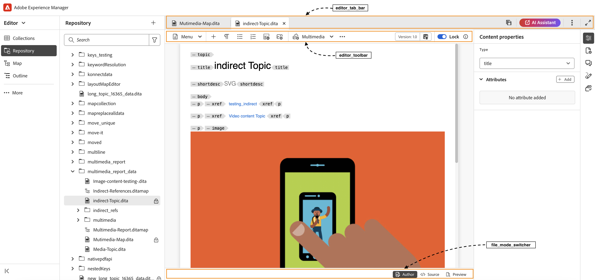
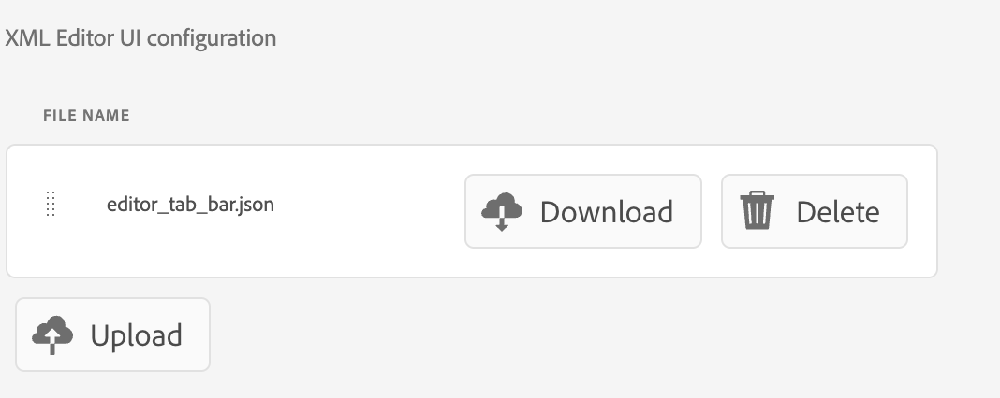

# Overzicht

Wanneer het migreren van oude UI naar nieuwe AEM Guides UI, moeten de updates aan **ui_config** in flexibelere en modulaire configuraties UI worden omgezet. Dit kaderhulp keurt naadloos veranderingen in **editor_toolbar** en [ andere toolbars ](/help/courses/course-3/conver-ui-config.md#editing-json-for-different-screens) goed. Het proces ondersteunt ook het wijzigen van andere weergaven en widgets in de toepassing.


## JSON bewerken voor verschillende schermen

JSON-bestanden kunnen voor verschillende schermen en widgets worden toegevoegd aan de sectie UI Configuration van de XML Editor. Hieronder volgt een lijst met veel gebruikte widgets en hun id&#39;s:

1. [ editor_toolbar ](assets/toolbars/editor_toolbar.json): Webeditor toolbar die uit dossier en inhoudshandelingen bestaat.
1. [ editor_tab_bar ](assets/toolbars/editor_tab_bar.json): Van labels voorzien mening van open dossiers binnen webeditor, heeft acties u op geopende dossiers kunt uitvoeren.
1. [ file_mode_switch ](assets/toolbars/file_mode_switcher.json): Het helpt schakelen tussen verschillende beschikbare wijzen (auteur, bron, voorproef) voor de geopende dossiers binnen webeditor.

   

1. [ map_console_navigation_bar ](assets/toolbars/map_console_navigation_bar.json): Het is de informatiebar voor kaart die in kaartconsole wordt geopend. Hiermee kunt u de kaart wijzigen en hebt u toegang tot instellingen.
1. [ map_console_action_bar ](assets/toolbars/map_console_action_bar.json): Dit is de actiebar voor de punten van de kaartconsole zoals Vooraf ingestelde Output, Basislijn, Vertaling, en Rapporten die relevante informatie samen met hun respectieve actieknopen verstrekt.

   

1. [ home_navigation_bar ](assets/toolbars/home_navigation_bar.json): De bar van de Kopbal van Gidsen homepage waar het welkome bericht samen met geselecteerd omslagprofiel wordt getoond.

   

<br>

## Algemene structuur van elke JSON

Elke JSON volgt een consistente structuur:

1. **identiteitskaart**: Specificeert widget waar de component wordt aangepast.
1. **targetEditor**: Bepaalt wanneer om een knoop te tonen of te verbergen gebruikend redacteur en wijzeeigenschappen:

   Momenteel hebben wij deze **redacteur** en **wijze** in ons systeem.

   **redacteur**: ditamap, bookmap, subjectScheme, xml, css, vertaling, preset, pdf_preset

   **wijze**: auteur, bron, voorproef, toc, spleet

   (Opmerking: de toc-modus is van toepassing op de layoutweergave.)

1. **doel**: Specificeert waar de nieuwe component zal worden toegevoegd. Dit gebruikt sleutel-waardeparen of indexen voor unieke identificatie. Voorbeelden van weergavestatussen zijn:

   * **voeg** toe: voeg aan het eind toe.

   * **prepend**: Voeg aan het begin toe.

   * **vervangt**: Vervang een bestaande component.

Voorbeeld JSON-structuur:

```json
{
  "id" : "editor_toolbar",
  "view": {
    "items": [
      {
        ...,
        "targetEditor": {
          "mode": [
            "preview"
          ],
          "editor": [
            "xml"
          ]
        },
        "target": {
          "key": "label",
          "value": "Table",
          "viewState": "prepend"
        },
        ...
      },
    ]
  }
}
```

<br>

## Voorbeelden

Hieronder ziet u hoe u een knop op de editor-werkbalk kunt toevoegen, verwijderen of vervangen.

### Een knop toevoegen

Toevoegend een nieuwe knoop **Eigen Lijst van het Tussenvoegsel** in **editor_toolbar** om een eenvoudige lijst toe te voegen die slechts op voorproefwijze zichtbaar is.

```json
{
  "id": "editor_toolbar",
  "view": {
    "items": [
      {
        "icon": "table",
        "title": "Insert Custom Table",
        "on-click": {
          "name": "$$AUTHOR_INSERT_ELEMENT",
          "args": [
            "simpletable",
            "table",
            "choicetable"
          ]
        },
        "key": "$$AUTHOR_INSERT_ELEMENT",
        "targetEditor": {
          "mode": [
            "preview"
          ],
        },
        "target": {
          "key": "label",
          "value": "Table",
          "viewState": "prepend"
        }
      }
    ]
  }
}
```


### Een knop verwijderen

Een knop uit de werkbalk verwijderen. Hier wordt de knop Afbeelding toevoegen van de editor verwijderd.

```json
{
  "id": "editor_toolbar",
  "view": {
    "items": [
      {
        "hide": true,
        "target": {
          "key": "label",
          "value": "Image",
          "viewState": "replace"
        }
      }
    ]
  }
}
```

### Een knop vervangen

Het vervangen van de **Multimedia** knoop van de toolbar met **Youtube** knoop van de verbindingstoevoeging die slechts op auteurswijze zichtbaar is.

```json
{
  "id": "editor_toolbar",
  "view": {
    "items": [
      {
        "icon": "s2youtube",
        "title": "Youtube",
        "on-click": {
          "name": "$$AUTHOR_INSERT_ELEMENT",
          "args": "<object data='http://youtube.com'></object>"
        },
        "targetEditor": {
          "mode": [
            "author"
          ]
        },
        "target": {
          "key": "elementId",
          "value": "toolbar-multimedia",
          "viewState": "replace"
        }
      }
    ]
  }
}
```


<br>

## Aangepaste JSON&#39;s uploaden

1. Op **de configuratie van de Redacteur van XML** lusje klikt op **geeft** in de hoogste bar uit.
1. Nu in **UI van de Redacteur van XML configuratie** sub-sectie u a **zult kunnen zien uploadt** knoop.

   {width="400" height="150"}

1. U kunt op de aangepaste json klikken en deze uploaden. (De te uploaden zoon moet dezelfde naam hebben als de id van de widget die wordt aangepast)
1. Zodra geupload, druk **sparen** in hoogste bar.

   Voor elk geupload dossier kunt u **json ook schrappen** om zijn aanpassing uit UI te verwijderen of **download** om het opnieuw te bekijken of te wijzigen.

   {width="400" height="150"}

<br>


## Aangepaste CSS uploaden

U kunt ook CSS toevoegen om de vormgeving van aangepaste toegevoegde knoppen of bestaande widgets of knoppen in de gebruikersinterface aan te passen.

Voor een onlangs toegevoegde douaneknoop voeg een **extraclass** aan douaneknoop of component binnen JSON toe.
Voor een oude klasse kunt u elementen inspecteren en de bestaande klassen ook wijzigen.

```json
{
  "icon": "table",
  "title": "Insert Custom Table",
  "extraclass": "custom-css",
  "key": "$$AUTHOR_INSERT_ELEMENT",
  "targetEditor": {
    "mode": [
      "preview"
    ],
  },
  "target": {
    "key": "label",
    "value": "Table",
    "viewState": "prepend"
  }
}
```

1. Op **de configuratie van de Redacteur van XML** lusje klikt op **geeft** in de hoogste bar uit.
1. Nu in **de paginalay-out van de Redacteur van XML** sub-section u a **zult kunnen zien uploadt** knoop.

   {width="400" height="150"}

1. U kunt klikken en aangepaste css uploaden. (Alleen CSS-bestanden worden ondersteund)
1. Zodra geupload, druk **sparen** in hoogste bar.

   Voor elk geupload dossier kunt u **css ook schrappen** om zijn aanpassing uit UI te verwijderen of **download** om het opnieuw te bekijken of te wijzigen.

   {width="400" height="150"}


<br>

### Voorbeeld om knop-css aan te passen

Hier voegen wij een nieuwe knoop **Eigen Lijst van het Tussenvoegsel** in **editor_toolbar** toe om een eenvoudige lijst toe te voegen die slechts op voorproefwijze zichtbaar is en douanecss op het toe te passen.
Met deze optie wijzigt u de achtergrond van de knop en de tekengrootte van de titel.


```css
#editor_toolbar {
  .custom-css {
    background-color: burlywood;
    font-size: 2rem;  
  }
}
```

```json
{
  "id": "editor_toolbar",
  "view": {
    "items": [
      {
        "icon": "table",
        "title": "Insert Custom Table",
        "extraclass": "custom-css",
        ...
      }
    ]
  }
}
```

<br>

## Stappen om ui config in modulaire Jsons om te zetten

1. Van het scherm van de Navigatie, klik het [!UICONTROL **pictogram van Hulpmiddelen**].

   

1. Selecteer **Gidsen** op het linkerpaneel.

1. Klik de **tegel van Profielen van de 1&rbrace; omslag 0&rbrace;.**

   

1. Selecteer een mapprofiel.

1. Klik de [!UICONTROL **Configuratie van de Redacteur van XML**] tabel.

1. U kunt op **klikken zet UI config in JSON** knoop om. Dit zal **editor_toolbar** en **map_console_action_bar** json produceren die de veranderingen bevat die in **worden gedaan ui_config**.

    om

1. U kunt de steekproef controleren produceerde zonen voor [ de toolbar van de Redacteur ](assets/editor_toolbar.json) en [ bar van de de consolactie van de Kaart ](assets/map_console_action_bar.json)


>[!NOTE]
>
>De veranderingen die aan **worden aangebracht toolbar** en **topbar** secties worden toegevoegd in **editor_toolbar** json die op de pagina van de Redacteur kan worden gezien. De veranderingen die aan knopen met betrekking tot Voorinstellingen of Vertaling in **worden aangebracht ui_config** worden toegevoegd aan **map_console_action_bar** json die op de pagina van de Console van de Kaart kan worden gezien.
